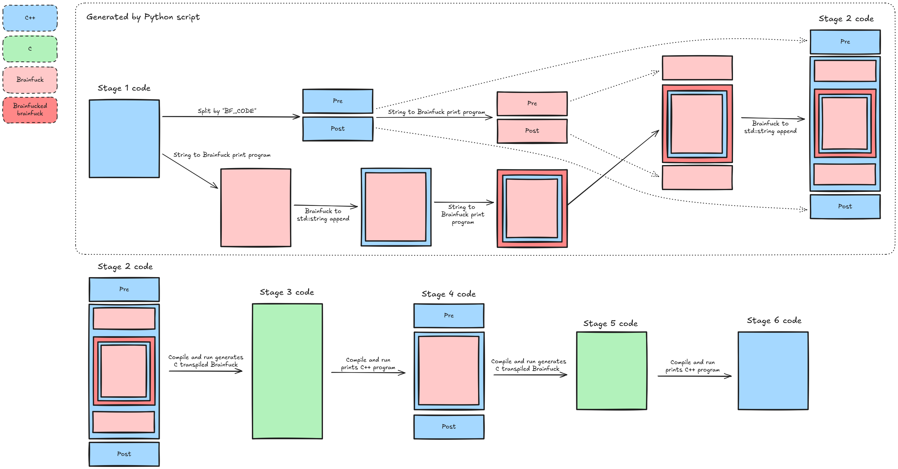

# Brainfuck

This repo contains

- a constexpr Brainfuck interpreter.
- a Brainfuck C transpiler.
- a Brainfuckception C transpiler.


## Build

```bash
$ mkdir build && cd build
$ cmake .. && make
```

## Constexpr interpreter

A class that takes a `constexpr std::string_view` and let's the user read a
memory element with literally zero runtime cost.
I/O does not work for obvious reasons.

Try out on [Godbolt.org](https://godbolt.org/z/bYj5o68de)

```bash
$ cd constexpr-brainfuck/
$ make
g++ -std=c++20 -O1 main.cpp -o constexpr_bf
$ ./constexpr_bf
$ echo $?
7
# Only 0x7 is returned from main, no other instructions:
$ objdump -d --disassemble=main constexpr_bf
...
0000000000401106 <main>:
  401106:       b8 07 00 00 00          mov    $0x7,%eax
  40110b:       c3                      ret
...
```

## Transpiler

```bash
$ build/brainfuck-c-transpiler/brainfuck-c-transpiler > main.c \
    && gcc -O3 main.c -o print-c-code \
    && ./print-c-code > main_2.c \
    && gcc -O3 main_2.c -o print-hw \
    && ./print-hw
```

## Brainfuckception (bfception)

- A C++ program that when modified by a Python script is compiled and run,
- prints a Brainfuck transpiler in C that when compiled and run,
- prints a C++ program that when compiled and run,
- prints a Brainfuck transpiler in C that when compiled and run,
- prints a C++ program identical to the original C++ program.

Full circle!

```sh
$ cd bfception
$ make
./generate_stage_2.py stage_1.cpp -o stage_2.cpp
g++ -std=c++20 stage_2.cpp -o stage_2
./stage_2 > stage_3.c
gcc -std=c11 stage_3.c -o stage_3
./stage_3 > stage_4.cpp
g++ -std=c++20 stage_4.cpp -o stage_4
./stage_4 > stage_5.c
gcc -std=c11 stage_5.c -o stage_5
./stage_5 > stage_6.cpp
diff stage_1.cpp stage_6.cpp && echo The same!
The same!
```


